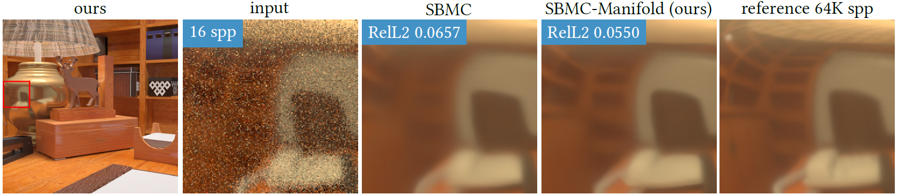
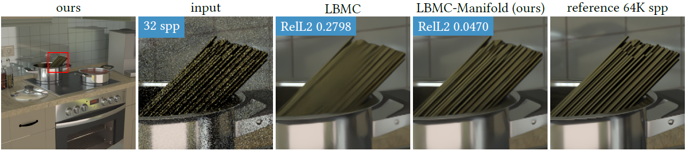

# WCMC: Weakly-Supervised Contrastive Learning in Path Manifold for Monte Carlo Image Reconstruction
### [Project Page](https://bit.ly/3uHRUPG) | [Paper](https://bit.ly/33G6vPG)
Official PyTorch implementation of WCMC.<br><br>
[Weakly-Supervised Contrastive Learning in Path Manifold for Monte Carlo Image Reconstruction](https://bit.ly/3uHRUPG)  
 [In-young Cho](https://bit.ly/3hma5qh),
 [Yuchi Huo](https://sgvr.kaist.ac.kr/~ychuo/)\*,
 [Sung-eui Yoon](https://sgvr.kaist.ac.kr/~sungeui/),\* <br>
 KAIST, Repulic of Korea  
  \*denotes co-corresponding authors  
in SIGGRAPH 2021




Scene credits
- ["Library-Home Office"](https://www.blendswap.com/blend/19984) by [ThePefDispenser](https://blendswap.com/profile/663773) under CC BY 3.0.
- ["My Kitchen"](https://www.blendswap.com/blend/9528) by [tokabilitor](https://www.blendswap.com/profile/41638) under CC0.

## Quick Start
0. State-of-the-art baselines: 
    - Kernel-predicting convolutional network (KPCN) [Bako et al. 2017]
        - Image-space method
    - Sample-based denoising network (SBMC) [Gharbi et al. 2019]
        - Sample-space method
    - Layer-based denoising network (LBMC) [Munkberg and Hasselgren 2020]
        - Sample-space method

1. Clone and build models of your interest; [KPCN [Bako et al. 2017], SBMC [Gharbi et al. 2019]](https://github.com/Mephisto405/SBMC-Manifold), and [LBMC [Munkberg and Hasselgren 2020]](https://github.com/Mephisto405/layerdenoise). We modify the original source to be compatible with our code.

2. Run the following demos.

## Demo

1. Train the diffuse and specular branches of KPCN-Vanilla simultaneously.

    ```
    python train_kpcn.py --single_gpu --batch_size 8 --val_epoch 1 --data_dir /mnt/ssd3/iycho/KPCN \
	--model_name KPCN_vanilla --desc "KPCN vanilla" --num_epoch 8 --lr_dncnn 1e-4 --train_branches
    ```

2. Fine-tune two branches of KPCN-Vanilla simultaneously.

    ```
    python train_kpcn.py --single_gpu --batch_size 8 --val_epoch 1 --data_dir /mnt/ssd3/iycho/KPCN \
	--model_name KPCN_vanilla --desc "KPCN vanilla" --num_epoch 10 --lr_dncnn 1e-6 \
	--start_epoch <??> --best_err <??>
    ```

3. More demos are presented at [train_kpcn.py](train_kpcn.py), [train_sbmc.py](train_sbmc.py), and [train_lbmc.py](train_lbmc.py).

## Tips for Reproducing this Paper

1. Try LBMC first.
    - We found that (unoptimized) LBMC does not require many dependencies and so does our framework (path embedding network + path disentangling loss).

2. Try training your network first and find optimal hyperparameters (e.g., learning rate). 
    - Then, attach our manifold framework to your reconstruction model. 
    - Use the optimal hyperparameters for the reconstruction network. 
    - Please take a look at the paper for other tips, such as setting the manifold-regression balancing parameter of our framework.

3. All you need are the implementations of the ...
    - [path descriptor](support/datasets.py),
    - [path embedding network](support/networks.py),
    - [path disentangling loss](support/losses.py), and
    - [training framework](support/interfaces.py).
    - The other code is just for visualization, debugging, training monitoring, etc. You may want to ignore it!

## Repository Overview

- train_kpcn.py         # Train KPCN with/without our manifold learning framework
- train_sbmc.py         # Train SBMC with/without our manifold learning framework
- train_lbmc.py         # Train LBMC with/without our manifold learning framework
- test_models.py        # Test any model
- support/              # All utilities to train/test models
	- datasets.py
	- img_utils.py
	- interfaces.py
	- losses.py
	- metrics.py
	- networks.py
	- utils.py

## Citation

```
@article{cho2021weakly,
  title={Weakly-Supervised Contrastive Learning in Path Manifold for Monte Carlo Image Reconstruction},
  author={Cho, In-Young and Huo, Yuchi and Yoon, Sung-Eui},
  journal={ACM Transactions on Graphics (TOG)},
  volume={40},
  number={4},
  pages={38:1--38:14},
  year={2021},
  publisher={ACM New York, NY, USA},
  url = {https://doi.org/10.1145/3450626.3459876},
}
```